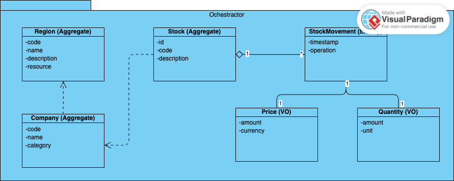

# Stock Advisor

## Overview
The stock advisor is an advisor for ingesting stock data from different regions and giving corresponding advice to do operations for manipulating stocks.

## UML
### Component Diagram

### Domain Models

